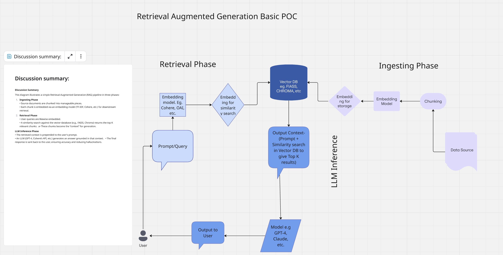

# Simple RAG Document QA App

A Gradio-based web application that compares a base LLM response versus a Retrieval-Augmented Generation (RAG) response using your own documents (PDF or TXT) or web pages (HTML).



---

## Demo
- **Public URL:** https://c7834b66e3d1631b7b.gradio.live/

---

## Features

- **Upload PDFs or TXT files** to index and query your own documents.  
- **Enter a URL** to fetch and index HTML content on the fly.  
- **Compare two outputs**:  
  - **Base Model**: LLM answer without any grounding context.  
  - **RAG-Enhanced**: LLM answer grounded on the most relevant snippets retrieved from your document or web page.

---

## Prerequisites

- Python 3.9 or newer  
- Git (to clone this repo)  
- A Cohere API key (set in `.env`)

---

## Installation

1. **Clone the repository**  
   ```bash
   git clone https://github.com/yourusername/Simple-RAG-Project.git
   cd Simple-RAG-Project
   ```

2. **Install dependencies (editable mode)**  
   ```bash
   pip install -e .
   ```

3. **Install NLTK data**  
   ```bash
   python -c "import nltk; nltk.download('punkt')"
   ```

4. **Configure environment**  
   Create a file named `.env` in the project root with:  
   ```ini
   SECRET_API_KEY=your_cohere_api_key_here
   ```

---

## Usage

Run the Gradio app:  
```bash
python app/main.py
```

- **Public access:** https://c7834b66e3d1631b7b.gradio.live/

### Stopping & Restarting

1. In the terminal where the app is running, press <kbd>Ctrl</kbd>+<kbd>C</kbd> to stop.  
2. Re-run:  
   ```bash
   python app/main.py
   ```

---

## How It Works

1. **Ingestion**: Upload a PDF/TXT or provide an HTML URL.  
2. **Preprocessing**: Text is chunked, tokenized, and stemmed.  
3. **Indexing**: Chunks are vectorized via TF–IDF within the `rag_builder` package.  
4. **Retrieval**: For a given user query, the top‑k relevant chunks are retrieved as context.  
5. **Generation**:  
   - **Base**: `get_response(query)` calls the LLM without context.  
   - **RAG**: `get_response(query, context)` includes retrieved snippets for a grounded answer.

---

## Project Structure

```
Simple-RAG-Project/
├── Simple_RAG_Workflow.png         # RAG workflow diagram
├── .env                            # Environment variables
├── README.md                       # Project documentation
├── pyproject.toml / setup.py       # Package configuration
├── rag_builder/                    # RAG package modules
│   ├── Ingesting_phase.py          # Document loading & preprocessing
│   ├── Retrival_phase.py           # Vectorization & retrieval logic
│   └── LLM_Inference.py            # Cohere API wrapper for chat
└── app/                            # Gradio UI entry point
    └── main.py                     # Launches the web interface
```

---

## Contributing

Contributions welcome! Please open an issue or submit a pull request.

